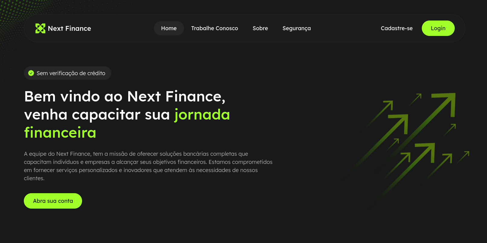

 

Desenvolvedor <strong>Front-End</strong>, cursando Desenvolvimento Full-Stack Python pela EBAC - Escola Britânica de Artes Criativas & Tecnologia. 
Atualmente terminando os estudos relacionados a Back-End, porém sigo aprimorando minhas habilidades no geral, realizando desafios e projetos pessoais.

 

## Estatísticas GitHub

 

  
  
  

## Minhas Habilidades

#### Maior afinidade (Principais):

&nbsp;
&nbsp;
&nbsp;
&nbsp;
&nbsp;
&nbsp;
&nbsp;
&nbsp;
&nbsp;
&nbsp;
&nbsp;

#### Conhecimento e prática (Secundárias):

&nbsp;
&nbsp;
&nbsp;
&nbsp;
&nbsp;
&nbsp;
&nbsp;
&nbsp;

#### Estudando no momento:

&nbsp;
&nbsp;
&nbsp;

#### Ambiente de trabalho:

&nbsp;
&nbsp;
 
 
 

## Último projeto realizado

#### Next Finance

Next Finance é uma página representativa de um banco virtual, com uma variedade de componentes interativos, incluindo carrosséis, seções de FAQ, grids dinâmicos, entre outros. O objetivo foi desenvolver uma aplicação que mostra um pouco mais das habilidades que desenvolvi no decorrer dos meus estudos. Atualmente, é o projeto mais elaborado do meu portfólio.

**Link Demo:** [Next Finance](https://project-next-finance.vercel.app/)

  

 
 

## Contato:

 

<a href="https://www.linkedin.com/in/rb-robson-barbosa/" target="_blank"> 

 

